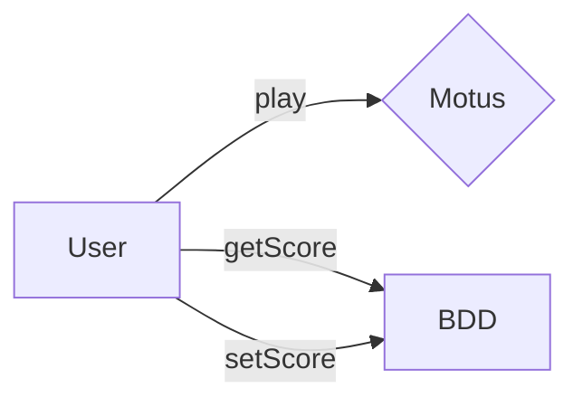

# Application motus

## Explanation

Allow users to play Motus (Wordle) and to keep track of the scores of the players.


## Run the application

```bash
node ./motus/app.js
```

## Run docker

```bash
cd ./motus
docker build -t motus_image .
docker run -p 3000:3000 motus_image
```

## Run docker-compose

```bash
docker-compose up
```

## Play Motus

In your browser type :
```
localhost:3000
```




