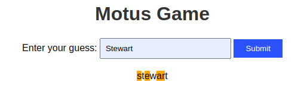
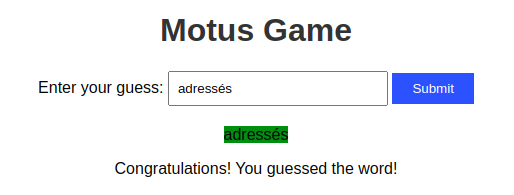
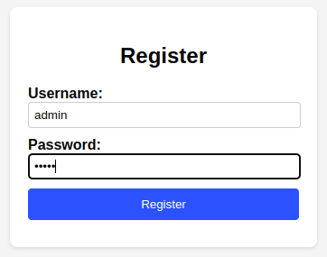
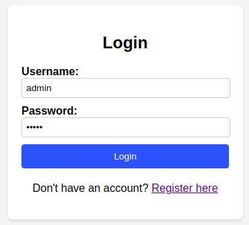
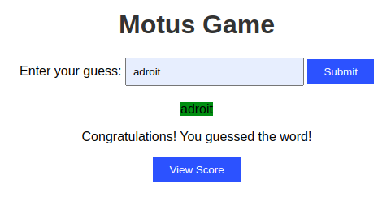
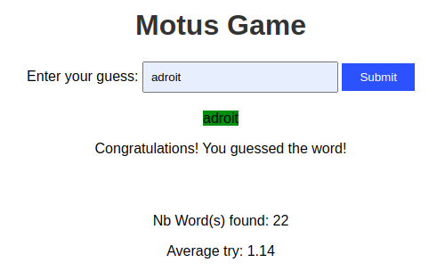
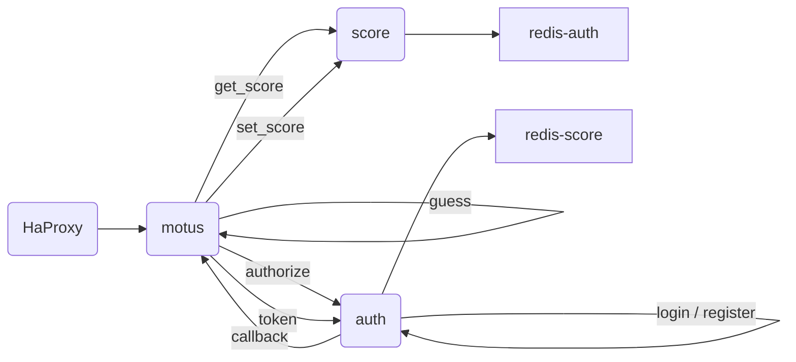

# Application motus

## Explanation

This project is a motus game. The main app allow a user to play motus. It works with two other services : a service to manage the score and a service for authentication.

## Technical details

### Run the project

```bash
docker-compose up
```

### Play Motus

In your browser type :
```
localhost:3000
```

If you are not connected, it will redirect you to authentification service. Once connected you will be able to play motus. At the end of the game, your score will be saved in the score service and displayed on the app.

### Details about servers and ports 

- The main app `motus` is running on port `3000`
- The `Load Balancer` server is running on port `8080`
- The `authentification` app is running on port `3003`
- The `redis-auth` database is running on port `16380`
- The `score` app is running on port `3001`
- The `redis-score` database is running on port `16379`
- Grafana is running on port `3004`
- Prometheus is running on port `9090`
- Loki is running on port `3100`
- Node exporter is running on port `9100`

### HaProxy configuration

It specifies the `load balancing` algorithm. Here, it's set to round-robin, meaning requests are distributed evenly among two servers.
  
  ```haproxy
  frontend http_front
    bind *:80
    default_backend http_back

  backend http_back
    balance roundrobin
    server motus1 motus:3000 check
    server motus2 motus:3000 check
  ```

### Details about APIs

*Motus APIs*

- `/callback` : to get the `username` from the authentification service using the `code` provided by the authentification service

  The param is `code` the token provided by the authentification service
  
  The response is a redirection to the main app with the `username` saved in the session parameters

- `/guess` : to compare the user's guess with the word to find and call the /setscore API if the user found the word.
  
  The param is `word` the user's guess
  
  The response is a html with the result of the comparison

  A successful guess will register the score in the score database through the score service and will display the score on the app.

<div style="display: flex;">
    
    
</div>

- `/metrics` : to get the metrics of request done and the number of successful authentication. These metrics are calculated by the prometheus server.
  
  The response is a json with the metrics or an error message

<div style="text-align: center;">
  
</div>

*Authentification APIs*

- `/authorize` : to check if the client id is valid
  
  The params are `clientid` and `redirect_uri` 
  
  The response is either a redirection to the /login API with a code or an error message

- `/register` : to register a new user
  
  The params are `username` and `password`

  The response is a message to confirm the registration or an error message

<div style="text-align: center;">
  
</div>

- `/login` : to log in the user
  
  The params are `username`, `password`, `clientid` and `redirect_uri`

  The response is a message to confirm the login or an error message

  The redirection url is stored in the sessions parameters if the login is successful

<div style="display: flex;">
    
    
</div>

- `/redirect` : to redirect the user to the main app
  
  The redirect url is stored in the sessions parameters

  The response is a redirection to the main app with a `token`

- `/token` : to get the username from the token
  
  The params are `token`

  The response is the username

*Score APIs*

- `/getscore` : to get the user's score
  
  The params are `player`

  The response is the user's score containing the total number of try and the number of successful guess

- `/setscore` : to set the user's score by updating the score in the database

  The params are `player` and `score`

  The response is a message to confirm the score update or an error message

<div style="display: flex;">
    
    
</div>

### Store data
- The `auth` app uses a redis database to store the users' passwords and codes
  
  The passwords are hashed using the sha256 algorithm and they are saved under the form `user:username:password : hashed_password`

  The codes are random numbers using the v4 algorithme and they are saved under the form `user:username:code : generatedCode`

- The `score` app uses a redis database to store the users' scores

  The total number of try  are saved under the form `player:nb_try : nb_try`

  The number of successful guess are saved under the form `player:nb_words : nb_words`

### Monitoring details 

Grafana is running on port `3004` and Prometheus is running on port `9090`

Logs are stored in a loki database running on port `3100`

If you want to visualize the logs, you can go to `localhost:3004` and add a new datasource with the url `http://loki:3100`

To visualize the metrics, you can go to `localhost:3004` and add a new datasource with the url `http://prometheus:9090`

Node exporter is running on port `9100`, you can vizualize the metrics on `http://localhost:9100/metrics`

### API Organisation




