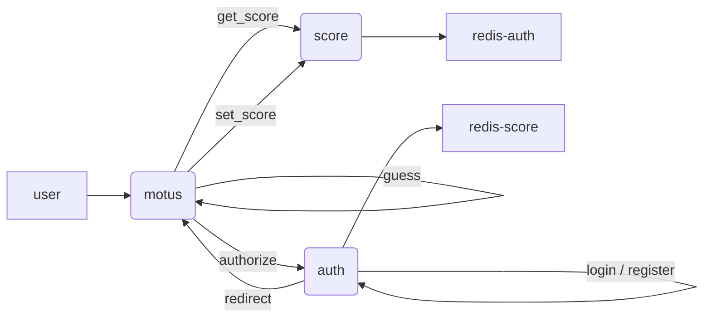

# Application motus

## Explanation

This project is a motus game. The main app allow a user to play motus. It works with two other services : a service to manage the score and a service for authentication.

## Technical details

### Run the project

```bash
docker-compose up
```

### Play Motus

In your browser type :
```
localhost:3000
```

If you are not connected, it will redirect you to authentification service. Once connected you will be able to play motus. At the end of the game, your score will be saved in the score service and displayed on the app.

### Details about servers and ports 

- The main app `motus` is running on port `3000`
- The `authentification` app is running on port `3003`
- The `redis-auth` database is running on port `16380`
- The `score` app is running on port `3001`
- The `redis-score` database is running on port `16379`

### Details about APIs

#### Motus APIs
- `/guess` : to compare the user's guess with the word to find and call the /setscore API if the user found the word.
  
  The param is `word` the user's guess
  
  The response is a html with the result of the comparison

#### Authentification APIs
- `authorize` : to check if the client id is valid
  
  The params are `clientid` and `redirect_uri` 
  
  The response is either a redirection to the /login API with a code or an error message

- `/register` : to register a new user
  
  The params are `username` and `password`

  The response is a message to confirm the registration or an error message

- `/login` : to log in the user
  
  The params are `username` and `password`

  The response is a message to confirm the login or an error message

- `/redirect` : to redirect the user to the main app
  
  The redirect url is stor in the sessions parameters

  The response is a redirection to the main app with a token

#### Score APIs
- `/getscore` : to get the user's score
  
  The params are `player`

  The response is the user's score

- `/setscore` : to set the user's score
- 
  The params are `player` and `score`

  The response is a message to confirm the score update or an error message

### Store data
- The `auth` app uses a redis database to store the users' passwords
- The `score` app uses a redis database to store the users' scores

### API Organisation




